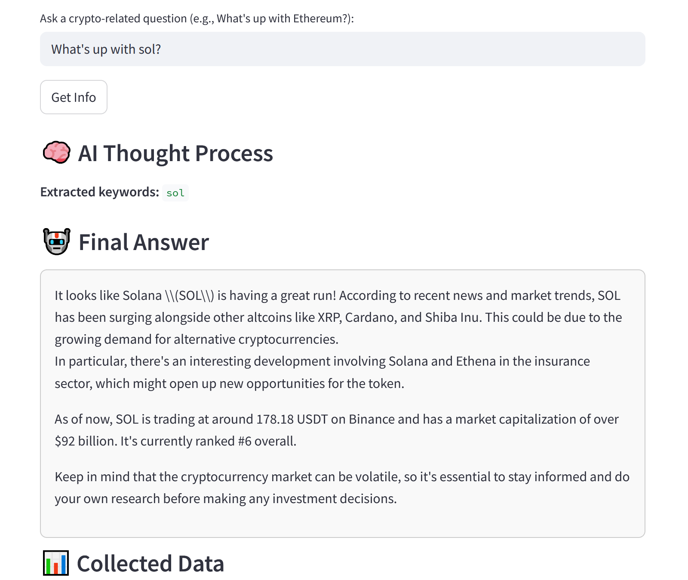
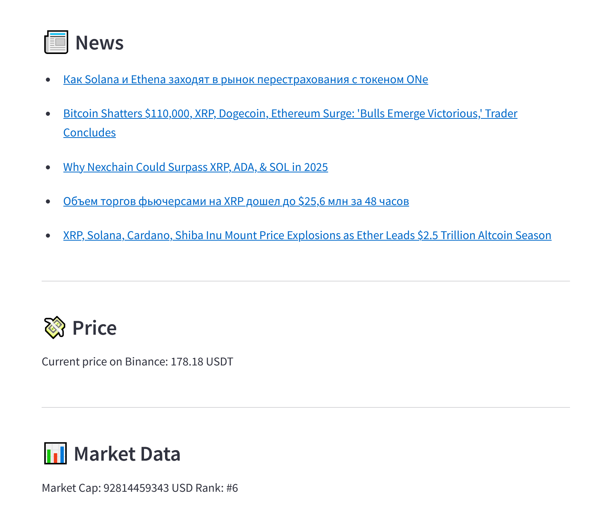

# 🧠 AI Crypto Assistant — Natural Language Crypto Insights

This is a **natural language crypto assistant** that provides live information about the cryptocurrency market using real-time data from public APIs, powered by:

- 🧠 **Ollama (LLaMA3 model)** — local LLM for generating answers
- 🌐 **CoinGecko** — market cap, rank, token info
- 📰 **CryptoPanic** — latest news headlines
- 💰 **Binance** — live price data
- 🖥 **Streamlit** — simple interactive UI

---

## ✨ Features

✅ Ask crypto-related questions in natural language  
✅ Automatic token detection from user queries  
✅ Live price from Binance, news from CryptoPanic  
✅ Summarized AI answer generated by LLaMA3 (via Ollama)  
✅ Fully local and private — no OpenAI keys needed

---

## 🚀 Quick Start

### 1. Clone this repo

```bash
git clone https://github.com/hsibAD/BT-ai-assistant.git
cd BT-ai-assistant
```

### 2. Install dependencies

```bash
pip install -r requirements.txt
```

> You need Python 3.9+ and Streamlit installed.

---

### 3. Run Ollama with LLaMA3

```bash
ollama pull llama3
ollama serve
```

> ⚠️ Requires ~6GB of free RAM for LLaMA3.

---

### 4. Run the app

```bash
streamlit run app.py
```

---

## 🧪 Example Questions

- What’s the current price of Ethereum?
- Tell me the latest news about Solana.
- Should I invest in Dogecoin?
- What is the market cap of Cardano?

---

## 📸 UI Preview

> Example screenshot of the app running locally:



---

## 🧠 Technologies

- [Ollama](https://ollama.com/)
- [Streamlit](https://streamlit.io/)
- [CoinGecko API](https://www.coingecko.com/en/api)
- [CryptoPanic API](https://cryptopanic.com/developers/api/)
- [Binance API](https://binance-docs.github.io/apidocs/spot/en/)

---

## 👨‍💻 Developers

- [Danial Yerzhigit](https://github.com/riqqer)  
- [Nuraiym Sadyk](https://github.com/wstyx-hh)  
- [Diana Abish](https://github.com/hsibAD)

---

## 📄 License

MIT